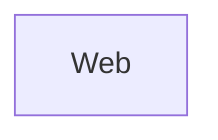

# Dependency and Feature Map

> Auto-generated dependency and feature map for the Sentra NestJS application

Generated on: 2025-08-04T08:58:25.228Z

## Table of Contents

1. [Project Overview](#project-overview)
2. [Architecture Summary](#architecture-summary)
3. [Feature Map](#feature-map)
4. [Module Dependencies](#module-dependencies)
5. [External Dependencies](#external-dependencies)
6. [Database Schema](#database-schema)
7. [API Endpoints](#api-endpoints)

## Project Overview

**Name:** N/A
**Version:** N/A
**Description:** N/A

## Architecture Summary

### Technology Stack

- **Framework:** NestJS
- **Database:** PostgreSQL with TypeORM
- **Authentication:** JWT with Passport.js
- **Architecture:** Multi-tenant SaaS with domain-driven design

## Feature Map

### Web

**Modules:** 2
- `Web/ClientApp/src/app/app.server.module.ts`
- `Web/ClientApp/src/app/app.module.ts`

**External Dependencies:** 14
- `@angular/common/http`
- `@angular/core`
- `@angular/core/testing`
- `@angular/forms`
- `@angular/platform-browser`
- `@angular/platform-browser-dynamic`
- `@angular/platform-browser-dynamic/testing`
- `@angular/platform-browser/animations`
- `@angular/platform-server`
- `@angular/router`
- `ngx-bootstrap/modal`
- `rxjs`
- `rxjs/operators`
- `src/api-authorization/authorize.interceptor`

## Module Dependencies

### App

**File:** `Web/ClientApp/src/app/app.module.ts`

## External Dependencies

### Production Dependencies

| Package | Version | Purpose |
|---------|---------|---------|

### Development Dependencies

| Package | Version | Purpose |
|---------|---------|---------|

## Database Schema

### Master Database Entities

### Tenant Database Entities

## API Endpoints
