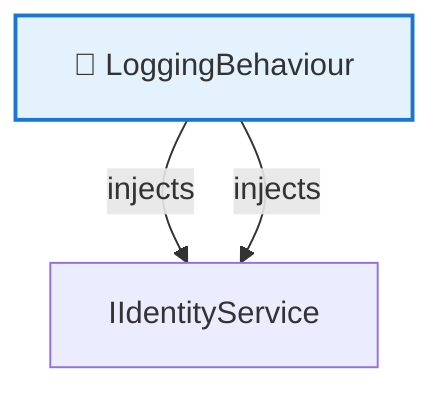
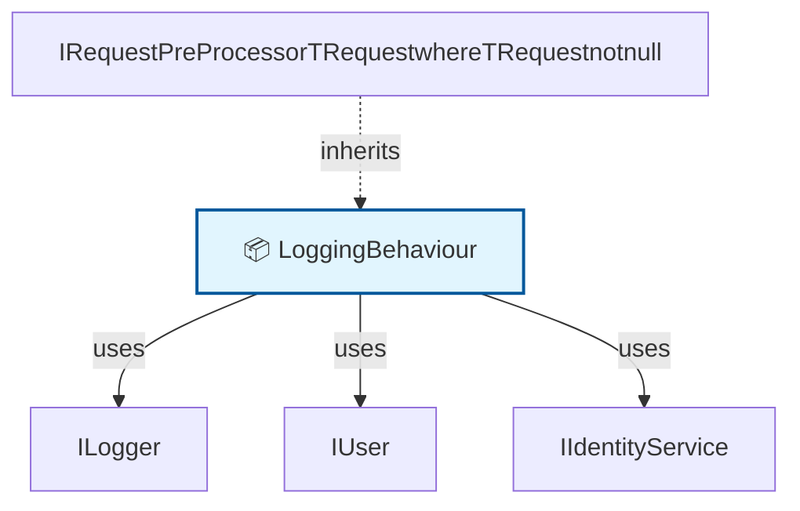

# 🗺️ Code Map: LoggingBehaviour

## 📁 File Information

**File Path:** `Common/Behaviours/LoggingBehaviour.cs`
**File Size:** 1140 bytes
**Last Modified:** 2025-07-22T16:06:25.722Z

---

**File Path:** `/Users/quang.vuong/Documents/Development/CleanArchitecture/src/Application/Common/Behaviours/LoggingBehaviour.cs`

## 📊 Quick Stats

| Type | Count |
|------|-------|
| 📁 Namespaces | 1 |
| 🏗️ Classes | 1 |
| 🎭 Interfaces | 0 |
| 📝 Enums | 0 |
| 📚 Using Statements | 3 |
| 🔗 Dependencies | 3 |
| 📞 Method Calls | 0 |
| 👨‍👩‍👧‍👦 Inheritance | 1 |
| 🔧 Service Classes | 1 |
| 💉 Service Dependencies | 2 |
| 🎯 Method Dependencies | 0 |

## 🔧 Service Hierarchy Analysis

### Service Classes Overview

| Service | Dependencies | Injection Type | Methods |
|---------|--------------|----------------|---------|
| **LoggingBehaviour** | 2 | constructor | 1 |

### Service Dependency Chain

### Service Details

#### 🔧 LoggingBehaviour

**Namespace:** CleanArchitecture.Application.Common.Behaviours
**Injection Type:** constructor

**Dependencies:**
- IIdentityService
- IIdentityService

**Methods with Dependencies:**

## 📋 Parameter Type Analysis

### Parameter Type Summary

| Type | Full Path | Namespace | Used In Methods | Occurrences |
|------|-----------|-----------|-----------------|-------------|
| `ILogger<TRequest>` | `CleanArchitecture.Application.Common.Interfaces.ILogger` | `CleanArchitecture.Application.Common.Interfaces` | 1 | 1 |
| `IUser` | `CleanArchitecture.Application.Common.Interfaces.IUser` | `CleanArchitecture.Application.Common.Interfaces` | 1 | 1 |
| `IIdentityService` | `CleanArchitecture.Application.Common.Interfaces.IIdentityService` | `CleanArchitecture.Application.Common.Interfaces` | 1 | 1 |

### Method Parameter Breakdown

#### 🔧 LoggingBehaviour.LoggingBehaviour

**Return Type**: `public`

**Parameters**:
- **logger**: `ILogger<TRequest>` → *File not found for type: ILogger<TRequest>*
- **user**: `IUser` → `/Users/quang.vuong/Documents/Development/CleanArchitecture/src/Application/Common/Interfaces/IUser.cs`
- **identityService**: `IIdentityService` → `/Users/quang.vuong/Documents/Development/CleanArchitecture/src/Application/Common/Interfaces/IIdentityService.cs`

## 🎯 Method Dependency Analysis

*No method dependencies found*

## 🕸️ Visual Dependency Graph

## 🌳 Class Hierarchy

*No inheritance relationships found*

## 📋 Dependencies Matrix

| Class | Dependencies |
|-------|---------------|
| **LoggingBehaviour** | ILogger, IUser, IIdentityService, IRequestPreProcessor<TRequest> where TRequest : notnull |

## 🔍 Detailed Structure

### 📁 CleanArchitecture.Application.Common.Behaviours

#### 🏗️ LoggingBehaviour 📦

**Line:** 7 | **Access:** public | **Extends:** IRequestPreProcessor<TRequest> where TRequest : notnull

**🔗 Dependencies:** ILogger, IUser, IIdentityService, IRequestPreProcessor<TRequest> where TRequest : notnull

**🔧 Constructors:**
- `LoggingBehaviour(ILogger<TRequest> logger, IUser user, IIdentityService identityService)` (Line 13)
  - **logger**: `ILogger<TRequest>` → Generic: ILogger<TRequest>
  - **user**: `IUser`
  - **identityService**: `IIdentityService`

**📊 Fields:**
- `ILogger _logger` (Line 9) - private [readonly]
- `IUser _user` (Line 10) - private [readonly]
- `IIdentityService _identityService` (Line 11) - private [readonly]

