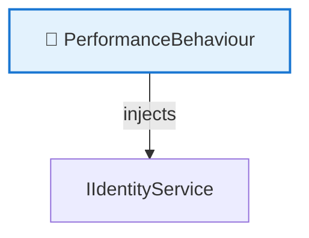
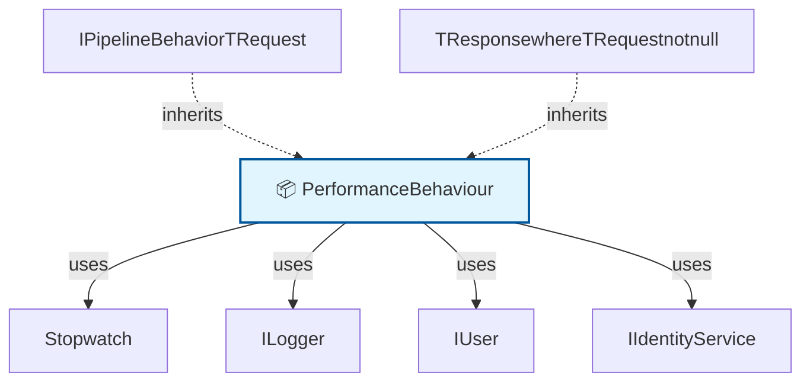

# 🗺️ Code Map: PerformanceBehaviour

## 📁 File Information

**File Path:** `Common/Behaviours/PerformanceBehaviour.cs`
**File Size:** 1662 bytes
**Last Modified:** 2025-07-22T16:06:25.722Z

---

**File Path:** `/Users/quang.vuong/Documents/Development/CleanArchitecture/src/Application/Common/Behaviours/PerformanceBehaviour.cs`

## 📊 Quick Stats

| Type | Count |
|------|-------|
| 📁 Namespaces | 1 |
| 🏗️ Classes | 1 |
| 🎭 Interfaces | 0 |
| 📝 Enums | 0 |
| 📚 Using Statements | 3 |
| 🔗 Dependencies | 4 |
| 📞 Method Calls | 0 |
| 👨‍👩‍👧‍👦 Inheritance | 2 |
| 🔧 Service Classes | 1 |
| 💉 Service Dependencies | 1 |
| 🎯 Method Dependencies | 0 |

## 🔧 Service Hierarchy Analysis

### Service Classes Overview

| Service | Dependencies | Injection Type | Methods |
|---------|--------------|----------------|---------|
| **PerformanceBehaviour** | 1 | field | 0 |

### Service Dependency Chain

### Service Details

#### 🔧 PerformanceBehaviour

**Namespace:** CleanArchitecture.Application.Common.Behaviours
**Injection Type:** field

**Dependencies:**
- IIdentityService

## 📋 Parameter Type Analysis

*No parameters found*

## 🎯 Method Dependency Analysis

*No method dependencies found*

## 🕸️ Visual Dependency Graph

## 🌳 Class Hierarchy

*No inheritance relationships found*

## 📋 Dependencies Matrix

| Class | Dependencies |
|-------|---------------|
| **PerformanceBehaviour** | Stopwatch, ILogger, IUser, IIdentityService, IPipelineBehavior<TRequest, TResponse> where TRequest : notnull |

## 🔍 Detailed Structure

### 📁 CleanArchitecture.Application.Common.Behaviours

#### 🏗️ PerformanceBehaviour 📦

**Line:** 7 | **Access:** public | **Extends:** IPipelineBehavior<TRequest, TResponse> where TRequest : notnull

**🔗 Dependencies:** Stopwatch, ILogger, IUser, IIdentityService, IPipelineBehavior<TRequest, TResponse> where TRequest : notnull

**📊 Fields:**
- `Stopwatch _timer` (Line 9) - private [readonly]
- `ILogger<TRequest> _logger` (Line 10) - private [readonly]
- `IUser _user` (Line 11) - private [readonly]
- `IIdentityService _identityService` (Line 12) - private [readonly]

