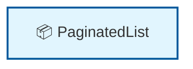

# 🗺️ Code Map: PaginatedList

## 📁 File Information

**File Path:** `Common/Models/PaginatedList.cs`
**File Size:** 1038 bytes
**Last Modified:** 2025-07-22T16:06:25.723Z

---


**File Path:** `/Users/quang.vuong/Documents/Development/CleanArchitecture/src/Application/Common/Models/PaginatedList.cs`

## 📊 Quick Stats

| Type | Count |
|------|-------|
| 📁 Namespaces | 1 |
| 🏗️ Classes | 1 |
| 🎭 Interfaces | 0 |
| 📝 Enums | 0 |
| 📚 Using Statements | 0 |
| 🔗 Dependencies | 0 |
| 📞 Method Calls | 0 |
| 👨‍👩‍👧‍👦 Inheritance | 0 |
| 🔧 Service Classes | 0 |
| 💉 Service Dependencies | 0 |
| 🎯 Method Dependencies | 0 |

## 🔧 Service Hierarchy Analysis

*No service classes found*

## 📋 Parameter Type Analysis

*No parameters found*

## 🎯 Method Dependency Analysis

*No method dependencies found*

## 🕸️ Visual Dependency Graph



## 🌳 Class Hierarchy

```
📦 PaginatedList
```

## 📋 Dependencies Matrix

| Class | Dependencies |
|-------|---------------|
| **PaginatedList** | _none_ |

## 🔍 Detailed Structure

### 📁 CleanArchitecture.Application.Common.Models

#### 🏗️ PaginatedList 📦

**Line:** 3 | **Access:** public

