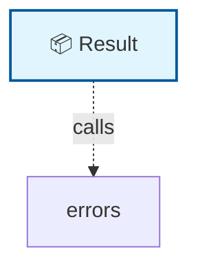

# 🗺️ Code Map: Result

## 📁 File Information

**File Path:** `Common/Models/Result.cs`
**File Size:** 530 bytes
**Last Modified:** 2025-07-22T16:06:25.723Z

---


**File Path:** `/Users/quang.vuong/Documents/Development/CleanArchitecture/src/Application/Common/Models/Result.cs`

## 📊 Quick Stats

| Type | Count |
|------|-------|
| 📁 Namespaces | 1 |
| 🏗️ Classes | 1 |
| 🎭 Interfaces | 0 |
| 📝 Enums | 0 |
| 📚 Using Statements | 0 |
| 🔗 Dependencies | 0 |
| 📞 Method Calls | 1 |
| 👨‍👩‍👧‍👦 Inheritance | 0 |
| 🔧 Service Classes | 1 |
| 💉 Service Dependencies | 0 |
| 🎯 Method Dependencies | 1 |

## 🔧 Service Hierarchy Analysis

### Service Classes Overview

| Service | Dependencies | Injection Type | Methods |
|---------|--------------|----------------|---------|
| **Result** | 0 | constructor | 1 |

### Service Dependency Chain


### Service Details

#### 🔧 Result

**Namespace:** CleanArchitecture.Application.Common.Models
**Injection Type:** constructor

**Methods with Dependencies:**

## 📋 Parameter Type Analysis

### Parameter Type Summary

| Type | Full Path | Namespace | Used In Methods | Occurrences |
|------|-----------|-----------|-----------------|-------------|
| `bool` | `System.bool` | `System` | 1 | 1 |
| `IEnumerable<string>` | `IEnumerable` | `unknown` | 1 | 1 |

### Method Parameter Breakdown

#### 🔧 Result.Result

**Return Type**: `internal`

**Parameters**:
- **succeeded**: `bool`
- **errors**: `IEnumerable<string>` → *File not found for type: IEnumerable<string>*

## 🎯 Method Dependency Analysis

### Method Call Hierarchy

#### 🔧 Result

**Result()** dependencies:
- Line 8: errors.ToArray()

### Method Call Flow

```mermaid
graph LR
    ResultResult[Result.Result()]
    errorsToArray[errors.ToArray()]
    ResultResult --> errorsToArray

    classDef method fill:#fff3e0,stroke:#f57c00,stroke-width:2px
```

## 🕸️ Visual Dependency Graph



## 🌳 Class Hierarchy

```
📦 Result
```

## 📋 Dependencies Matrix

| Class | Dependencies |
|-------|---------------|
| **Result** | errors |

## 🔍 Detailed Structure

### 📁 CleanArchitecture.Application.Common.Models

#### 🏗️ Result 📦

**Line:** 3 | **Access:** public

**🔗 Dependencies:** errors

**📞 Calls:** errors.ToArray()

**🔧 Constructors:**
- `Result(bool succeeded, IEnumerable<string> errors)` (Line 5)
  - **succeeded**: `bool`
  - **errors**: `IEnumerable<string>` → Generic: IEnumerable<string>

