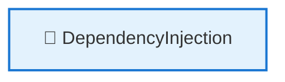
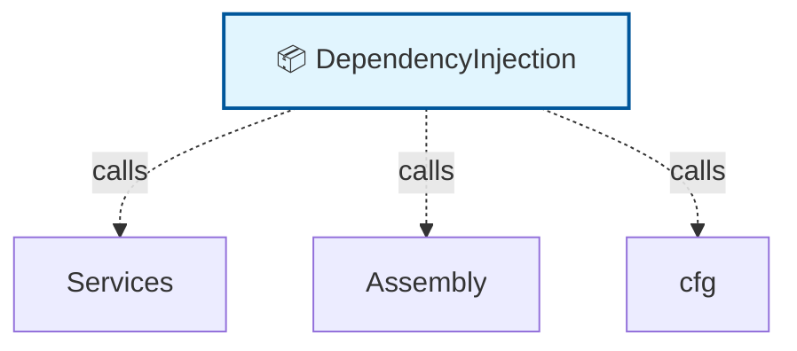

# 🗺️ Code Map: DependencyInjection

## 📁 File Information

**File Path:** `DependencyInjection.cs`
**File Size:** 985 bytes
**Last Modified:** 2025-07-22T16:06:25.723Z

---


**File Path:** `/Users/quang.vuong/Documents/Development/CleanArchitecture/src/Application/DependencyInjection.cs`

## 📊 Quick Stats

| Type | Count |
|------|-------|
| 📁 Namespaces | 1 |
| 🏗️ Classes | 1 |
| 🎭 Interfaces | 0 |
| 📝 Enums | 0 |
| 📚 Using Statements | 3 |
| 🔗 Dependencies | 0 |
| 📞 Method Calls | 11 |
| 👨‍👩‍👧‍👦 Inheritance | 0 |
| 🔧 Service Classes | 1 |
| 💉 Service Dependencies | 0 |
| 🎯 Method Dependencies | 1 |

## 🔧 Service Hierarchy Analysis

### Service Classes Overview

| Service | Dependencies | Injection Type | Methods |
|---------|--------------|----------------|---------|
| **DependencyInjection** | 0 | none | 1 |

### Service Dependency Chain



### Service Details

#### 🔧 DependencyInjection

**Namespace:** Microsoft.Extensions.DependencyInjection
**Injection Type:** none

**Methods with Dependencies:**

## 📋 Parameter Type Analysis

### Parameter Type Summary

| Type | Full Path | Namespace | Used In Methods | Occurrences |
|------|-----------|-----------|-----------------|-------------|
| `unknown` | `System.Reflection.unknown` | `System.Reflection` | 1 | 1 |

### Method Parameter Breakdown

#### 🔧 DependencyInjection.AddApplicationServices

**Parameters**:
- **unknown**: `unknown` → *File not found for type: unknown*

## 🎯 Method Dependency Analysis

### Method Call Hierarchy

#### 🔧 DependencyInjection

**AddApplicationServices()** dependencies:
- Line 11: Services.AddAutoMapper()
- Line 11: Assembly.GetExecutingAssembly()
- Line 13: Services.AddValidatorsFromAssembly()
- Line 13: Assembly.GetExecutingAssembly()
- Line 15: Services.AddMediatR()
- Line 16: cfg.RegisterServicesFromAssembly()
- Line 16: Assembly.GetExecutingAssembly()
- Line 17: cfg.AddBehavior()
- Line 18: cfg.AddBehavior()
- Line 19: cfg.AddBehavior()
- Line 20: cfg.AddBehavior()

### Method Call Flow

```mermaid
graph LR
    DependencyInjectionAddApplicationServices[DependencyInjection.AddApplicationServices()]
    ServicesAddAutoMapper[Services.AddAutoMapper()]
    DependencyInjectionAddApplicationServices --> ServicesAddAutoMapper
    AssemblyGetExecutingAssembly[Assembly.GetExecutingAssembly()]
    DependencyInjectionAddApplicationServices --> AssemblyGetExecutingAssembly
    ServicesAddValidatorsFromAssembly[Services.AddValidatorsFromAssembly()]
    DependencyInjectionAddApplicationServices --> ServicesAddValidatorsFromAssembly
    AssemblyGetExecutingAssembly[Assembly.GetExecutingAssembly()]
    DependencyInjectionAddApplicationServices --> AssemblyGetExecutingAssembly
    ServicesAddMediatR[Services.AddMediatR()]
    DependencyInjectionAddApplicationServices --> ServicesAddMediatR
    cfgRegisterServicesFromAssembly[cfg.RegisterServicesFromAssembly()]
    DependencyInjectionAddApplicationServices --> cfgRegisterServicesFromAssembly
    AssemblyGetExecutingAssembly[Assembly.GetExecutingAssembly()]
    DependencyInjectionAddApplicationServices --> AssemblyGetExecutingAssembly
    cfgAddBehavior[cfg.AddBehavior()]
    DependencyInjectionAddApplicationServices --> cfgAddBehavior
    cfgAddBehavior[cfg.AddBehavior()]
    DependencyInjectionAddApplicationServices --> cfgAddBehavior
    cfgAddBehavior[cfg.AddBehavior()]
    DependencyInjectionAddApplicationServices --> cfgAddBehavior
    cfgAddBehavior[cfg.AddBehavior()]
    DependencyInjectionAddApplicationServices --> cfgAddBehavior

    classDef method fill:#fff3e0,stroke:#f57c00,stroke-width:2px
```

## 🕸️ Visual Dependency Graph



## 🌳 Class Hierarchy

```
📦 DependencyInjection
```

## 📋 Dependencies Matrix

| Class | Dependencies |
|-------|---------------|
| **DependencyInjection** | Services, Assembly, cfg |

## 🔍 Detailed Structure

### 📁 Microsoft.Extensions.DependencyInjection

#### 🏗️ DependencyInjection 🔧

**Line:** 7 | **Access:** public | **Modifiers:** static

**🔗 Dependencies:** Services, Assembly, cfg

**📞 Calls:** Services.AddAutoMapper(), Assembly.GetExecutingAssembly(), Services.AddValidatorsFromAssembly(), Assembly.GetExecutingAssembly(), Services.AddMediatR(), cfg.RegisterServicesFromAssembly(), Assembly.GetExecutingAssembly(), cfg.AddBehavior(), cfg.AddBehavior(), cfg.AddBehavior(), cfg.AddBehavior()

