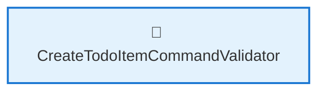
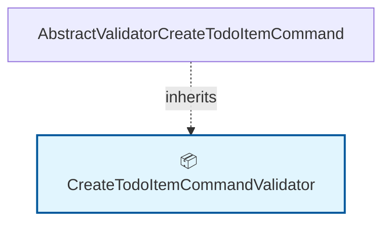

# 🗺️ Code Map: CreateTodoItemCommandValidator

## 📁 File Information

**File Path:** `TodoItems/Commands/CreateTodoItem/CreateTodoItemCommandValidator.cs`
**File Size:** 313 bytes
**Last Modified:** 2025-07-22T16:06:25.724Z

---

**File Path:** `/Users/quang.vuong/Documents/Development/CleanArchitecture/src/Application/TodoItems/Commands/CreateTodoItem/CreateTodoItemCommandValidator.cs`

## 📊 Quick Stats

| Type | Count |
|------|-------|
| 📁 Namespaces | 1 |
| 🏗️ Classes | 1 |
| 🎭 Interfaces | 0 |
| 📝 Enums | 0 |
| 📚 Using Statements | 0 |
| 🔗 Dependencies | 0 |
| 📞 Method Calls | 0 |
| 👨‍👩‍👧‍👦 Inheritance | 1 |
| 🔧 Service Classes | 1 |
| 💉 Service Dependencies | 0 |
| 🎯 Method Dependencies | 0 |

## 🔧 Service Hierarchy Analysis

### Service Classes Overview

| Service | Dependencies | Injection Type | Methods |
|---------|--------------|----------------|---------|
| **CreateTodoItemCommandValidator** | 0 | constructor | 1 |

### Service Dependency Chain

### Service Details

#### 🔧 CreateTodoItemCommandValidator

**Namespace:** CleanArchitecture.Application.TodoItems.Commands.CreateTodoItem
**Injection Type:** constructor

**Methods with Dependencies:**

## 📋 Parameter Type Analysis

*No parameters found*

## 🎯 Method Dependency Analysis

*No method dependencies found*

## 🕸️ Visual Dependency Graph

## 🌳 Class Hierarchy

*No inheritance relationships found*

## 📋 Dependencies Matrix

| Class | Dependencies |
|-------|---------------|
| **CreateTodoItemCommandValidator** | AbstractValidator<CreateTodoItemCommand> |

## 🔍 Detailed Structure

### 📁 CleanArchitecture.Application.TodoItems.Commands.CreateTodoItem

#### 🏗️ CreateTodoItemCommandValidator 📦

**Line:** 3 | **Access:** public | **Extends:** AbstractValidator<CreateTodoItemCommand>

**🔗 Dependencies:** AbstractValidator<CreateTodoItemCommand>

**🔧 Constructors:**
- `CreateTodoItemCommandValidator()` (Line 5)

