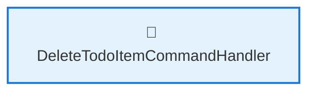
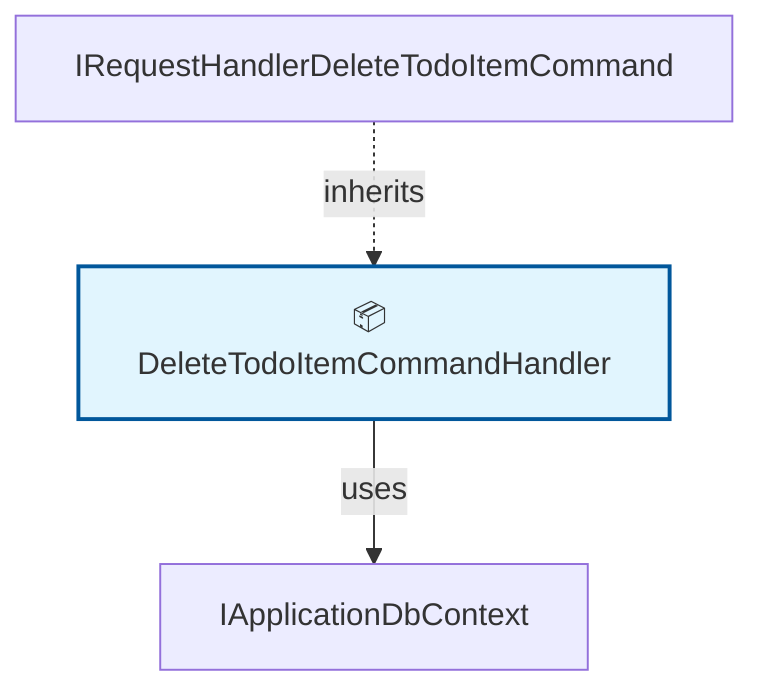

# 🗺️ Code Map: DeleteTodoItem

## 📁 File Information

**File Path:** `TodoItems/Commands/DeleteTodoItem/DeleteTodoItem.cs`
**File Size:** 936 bytes
**Last Modified:** 2025-07-22T16:06:25.724Z

---

**File Path:** `/Users/quang.vuong/Documents/Development/CleanArchitecture/src/Application/TodoItems/Commands/DeleteTodoItem/DeleteTodoItem.cs`

## 📊 Quick Stats

| Type | Count |
|------|-------|
| 📁 Namespaces | 1 |
| 🏗️ Classes | 1 |
| 🎭 Interfaces | 0 |
| 📝 Enums | 0 |
| 📚 Using Statements | 2 |
| 🔗 Dependencies | 1 |
| 📞 Method Calls | 0 |
| 👨‍👩‍👧‍👦 Inheritance | 1 |
| 🔧 Service Classes | 1 |
| 💉 Service Dependencies | 0 |
| 🎯 Method Dependencies | 0 |

## 🔧 Service Hierarchy Analysis

### Service Classes Overview

| Service | Dependencies | Injection Type | Methods |
|---------|--------------|----------------|---------|
| **DeleteTodoItemCommandHandler** | 0 | constructor | 1 |

### Service Dependency Chain

### Service Details

#### 🔧 DeleteTodoItemCommandHandler

**Namespace:** CleanArchitecture.Application.TodoItems.Commands.DeleteTodoItem
**Injection Type:** constructor

**Methods with Dependencies:**

## 📋 Parameter Type Analysis

### Parameter Type Summary

| Type | Full Path | Namespace | Used In Methods | Occurrences |
|------|-----------|-----------|-----------------|-------------|
| `IApplicationDbContext` | `CleanArchitecture.Application.Common.Interfaces.IApplicationDbContext` | `CleanArchitecture.Application.Common.Interfaces` | 1 | 1 |

### Method Parameter Breakdown

#### 🔧 DeleteTodoItemCommandHandler.DeleteTodoItemCommandHandler

**Return Type**: `public`

**Parameters**:
- **context**: `IApplicationDbContext` → `/Users/quang.vuong/Documents/Development/CleanArchitecture/src/Application/Common/Interfaces/IApplicationDbContext.cs`

## 🎯 Method Dependency Analysis

*No method dependencies found*

## 🕸️ Visual Dependency Graph

## 🌳 Class Hierarchy

*No inheritance relationships found*

## 📋 Dependencies Matrix

| Class | Dependencies |
|-------|---------------|
| **DeleteTodoItemCommandHandler** | IApplicationDbContext, IRequestHandler<DeleteTodoItemCommand> |

## 🔍 Detailed Structure

### 📁 CleanArchitecture.Application.TodoItems.Commands.DeleteTodoItem

#### 🏗️ DeleteTodoItemCommandHandler 📦

**Line:** 8 | **Access:** public | **Extends:** IRequestHandler<DeleteTodoItemCommand>

**🔗 Dependencies:** IApplicationDbContext, IRequestHandler<DeleteTodoItemCommand>

**🔧 Constructors:**
- `DeleteTodoItemCommandHandler(IApplicationDbContext context)` (Line 12)
  - **context**: `IApplicationDbContext`

**📊 Fields:**
- `IApplicationDbContext _context` (Line 10) - private [readonly]

