# 🗺️ Code Map: UpdateTodoItemCommandValidator

## 📁 File Information

**File Path:** `TodoItems/Commands/UpdateTodoItem/UpdateTodoItemCommandValidator.cs`
**File Size:** 313 bytes
**Last Modified:** 2025-07-22T16:06:25.724Z

---

**File Path:** `/Users/quang.vuong/Documents/Development/CleanArchitecture/src/Application/TodoItems/Commands/UpdateTodoItem/UpdateTodoItemCommandValidator.cs`

## 📊 Quick Stats

| Type | Count |
|------|-------|
| 📁 Namespaces | 1 |
| 🏗️ Classes | 1 |
| 🎭 Interfaces | 0 |
| 📝 Enums | 0 |
| 📚 Using Statements | 0 |
| 🔗 Dependencies | 0 |
| 📞 Method Calls | 0 |
| 👨‍👩‍👧‍👦 Inheritance | 1 |
| 🔧 Service Classes | 1 |
| 💉 Service Dependencies | 0 |
| 🎯 Method Dependencies | 0 |

## 🔧 Service Hierarchy Analysis

### Service Classes Overview

| Service | Dependencies | Injection Type | Methods |
|---------|--------------|----------------|---------|
| **UpdateTodoItemCommandValidator** | 0 | constructor | 1 |

### Service Dependency Chain

```mermaid
graph TD
    UpdateTodoItemCommandValidator[🔧 UpdateTodoItemCommandValidator]

    classDef service fill:#e3f2fd,stroke:#1976d2,stroke-width:2px
    class UpdateTodoItemCommandValidator service
```

### Service Details

#### 🔧 UpdateTodoItemCommandValidator

**Namespace:** CleanArchitecture.Application.TodoItems.Commands.UpdateTodoItem
**Injection Type:** constructor

**Methods with Dependencies:**

## 📋 Parameter Type Analysis

*No parameters found*

## 🎯 Method Dependency Analysis

*No method dependencies found*

## 🕸️ Visual Dependency Graph

```mermaid
graph TD
    UpdateTodoItemCommandValidator[📦 UpdateTodoItemCommandValidator]
    class UpdateTodoItemCommandValidator publicClass
    AbstractValidatorUpdateTodoItemCommand -.->|inherits| UpdateTodoItemCommandValidator

    classDef publicClass fill:#e1f5fe,stroke:#01579b,stroke-width:2px
    classDef privateClass fill:#fce4ec,stroke:#880e4f,stroke-width:2px
    classDef interface fill:#f3e5f5,stroke:#4a148c,stroke-width:2px
    classDef enum fill:#e8f5e8,stroke:#1b5e20,stroke-width:2px
```

## 🌳 Class Hierarchy

*No inheritance relationships found*

## 📋 Dependencies Matrix

| Class | Dependencies |
|-------|---------------|
| **UpdateTodoItemCommandValidator** | AbstractValidator<UpdateTodoItemCommand> |

## 🔍 Detailed Structure

### 📁 CleanArchitecture.Application.TodoItems.Commands.UpdateTodoItem

#### 🏗️ UpdateTodoItemCommandValidator 📦

**Line:** 3 | **Access:** public | **Extends:** AbstractValidator<UpdateTodoItemCommand>

**🔗 Dependencies:** AbstractValidator<UpdateTodoItemCommand>

**🔧 Constructors:**
- `UpdateTodoItemCommandValidator()` (Line 5)

