# 🗺️ Code Map: TodoItemBriefDto

## 📁 File Information

**File Path:** `TodoItems/Queries/GetTodoItemsWithPagination/TodoItemBriefDto.cs`
**File Size:** 462 bytes
**Last Modified:** 2025-07-22T16:06:25.724Z

---


**File Path:** `/Users/quang.vuong/Documents/Development/CleanArchitecture/src/Application/TodoItems/Queries/GetTodoItemsWithPagination/TodoItemBriefDto.cs`

## 📊 Quick Stats

| Type | Count |
|------|-------|
| 📁 Namespaces | 1 |
| 🏗️ Classes | 2 |
| 🎭 Interfaces | 0 |
| 📝 Enums | 0 |
| 📚 Using Statements | 1 |
| 🔗 Dependencies | 0 |
| 📞 Method Calls | 0 |
| 👨‍👩‍👧‍👦 Inheritance | 1 |
| 🔧 Service Classes | 1 |
| 💉 Service Dependencies | 0 |
| 🎯 Method Dependencies | 0 |

## 🔧 Service Hierarchy Analysis

### Service Classes Overview

| Service | Dependencies | Injection Type | Methods |
|---------|--------------|----------------|---------|
| **Mapping** | 0 | constructor | 1 |

### Service Dependency Chain


### Service Details

#### 🔧 Mapping

**Namespace:** CleanArchitecture.Application.TodoItems.Queries.GetTodoItemsWithPagination
**Injection Type:** constructor

**Methods with Dependencies:**

## 📋 Parameter Type Analysis

*No parameters found*

## 🎯 Method Dependency Analysis

*No method dependencies found*

## 🕸️ Visual Dependency Graph

```mermaid
graph TD
    TodoItemBriefDto[📦 TodoItemBriefDto]
    class TodoItemBriefDto publicClass
    Mapping[📦 Mapping]
    class Mapping privateClass
    Profile -.->|inherits| Mapping

    classDef publicClass fill:#e1f5fe,stroke:#01579b,stroke-width:2px
    classDef privateClass fill:#fce4ec,stroke:#880e4f,stroke-width:2px
    classDef interface fill:#f3e5f5,stroke:#4a148c,stroke-width:2px
    classDef enum fill:#e8f5e8,stroke:#1b5e20,stroke-width:2px
```



## 🌳 Class Hierarchy

```
📦 TodoItemBriefDto
```

## 📋 Dependencies Matrix

| Class | Dependencies |
|-------|---------------|
| **TodoItemBriefDto** | _none_ |
| **Mapping** | Profile |

## 🔍 Detailed Structure

### 📁 CleanArchitecture.Application.TodoItems.Queries.GetTodoItemsWithPagination

#### 🏗️ TodoItemBriefDto 📦

**Line:** 5 | **Access:** public

#### 🏗️ Mapping 📦

**Line:** 15 | **Access:** private | **Extends:** Profile

**🔗 Dependencies:** Profile

**🔧 Constructors:**
- `Mapping()` (Line 17)

