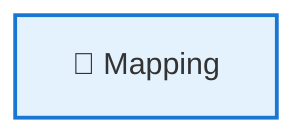
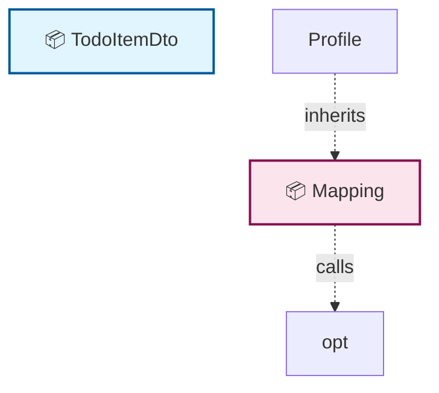

# 🗺️ Code Map: TodoItemDto

## 📁 File Information

**File Path:** `TodoLists/Queries/GetTodos/TodoItemDto.cs`
**File Size:** 600 bytes
**Last Modified:** 2025-07-22T16:06:25.726Z

---


**File Path:** `/Users/quang.vuong/Documents/Development/CleanArchitecture/src/Application/TodoLists/Queries/GetTodos/TodoItemDto.cs`

## 📊 Quick Stats

| Type | Count |
|------|-------|
| 📁 Namespaces | 1 |
| 🏗️ Classes | 2 |
| 🎭 Interfaces | 0 |
| 📝 Enums | 0 |
| 📚 Using Statements | 1 |
| 🔗 Dependencies | 0 |
| 📞 Method Calls | 1 |
| 👨‍👩‍👧‍👦 Inheritance | 1 |
| 🔧 Service Classes | 1 |
| 💉 Service Dependencies | 0 |
| 🎯 Method Dependencies | 1 |

## 🔧 Service Hierarchy Analysis

### Service Classes Overview

| Service | Dependencies | Injection Type | Methods |
|---------|--------------|----------------|---------|
| **Mapping** | 0 | constructor | 1 |

### Service Dependency Chain



### Service Details

#### 🔧 Mapping

**Namespace:** CleanArchitecture.Application.TodoLists.Queries.GetTodos
**Injection Type:** constructor

**Methods with Dependencies:**

## 📋 Parameter Type Analysis

*No parameters found*

## 🎯 Method Dependency Analysis

### Method Call Hierarchy

#### 🔧 Mapping

**Mapping()** dependencies:
- Line 24: opt.MapFrom()

### Method Call Flow

```mermaid
graph LR
    MappingMapping[Mapping.Mapping()]
    optMapFrom[opt.MapFrom()]
    MappingMapping --> optMapFrom

    classDef method fill:#fff3e0,stroke:#f57c00,stroke-width:2px
```

## 🕸️ Visual Dependency Graph



## 🌳 Class Hierarchy

```
📦 TodoItemDto
```

## 📋 Dependencies Matrix

| Class | Dependencies |
|-------|---------------|
| **TodoItemDto** | _none_ |
| **Mapping** | Profile, opt |

## 🔍 Detailed Structure

### 📁 CleanArchitecture.Application.TodoLists.Queries.GetTodos

#### 🏗️ TodoItemDto 📦

**Line:** 5 | **Access:** public

#### 🏗️ Mapping 📦

**Line:** 19 | **Access:** private | **Extends:** Profile

**🔗 Dependencies:** Profile, opt

**📞 Calls:** opt.MapFrom()

**🔧 Constructors:**
- `Mapping()` (Line 21)

