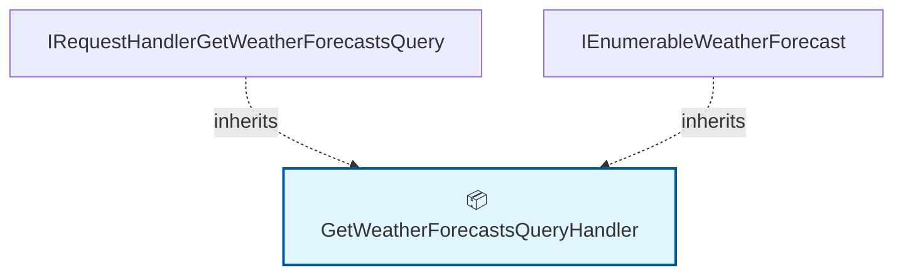

# 🗺️ Code Map: GetWeatherForecastsQuery

## 📁 File Information

**File Path:** `WeatherForecasts/Queries/GetWeatherForecasts/GetWeatherForecastsQuery.cs`
**File Size:** 1092 bytes
**Last Modified:** 2025-07-22T16:06:25.726Z

---

**File Path:** `/Users/quang.vuong/Documents/Development/CleanArchitecture/src/Application/WeatherForecasts/Queries/GetWeatherForecasts/GetWeatherForecastsQuery.cs`

## 📊 Quick Stats

| Type | Count |
|------|-------|
| 📁 Namespaces | 1 |
| 🏗️ Classes | 1 |
| 🎭 Interfaces | 0 |
| 📝 Enums | 0 |
| 📚 Using Statements | 0 |
| 🔗 Dependencies | 0 |
| 📞 Method Calls | 0 |
| 👨‍👩‍👧‍👦 Inheritance | 2 |
| 🔧 Service Classes | 1 |
| 💉 Service Dependencies | 0 |
| 🎯 Method Dependencies | 0 |

## 🔧 Service Hierarchy Analysis

### Service Classes Overview

| Service | Dependencies | Injection Type | Methods |
|---------|--------------|----------------|---------|
| **GetWeatherForecastsQueryHandler** | 0 | none | 0 |

### Service Dependency Chain

### Service Details

#### 🔧 GetWeatherForecastsQueryHandler

**Namespace:** CleanArchitecture.Application.WeatherForecasts.Queries.GetWeatherForecasts
**Injection Type:** none

## 📋 Parameter Type Analysis

*No parameters found*

## 🎯 Method Dependency Analysis

*No method dependencies found*

## 🕸️ Visual Dependency Graph

## 🌳 Class Hierarchy

*No inheritance relationships found*

## 📋 Dependencies Matrix

| Class | Dependencies |
|-------|---------------|
| **GetWeatherForecastsQueryHandler** | IRequestHandler<GetWeatherForecastsQuery, IEnumerable<WeatherForecast>> |

## 🔍 Detailed Structure

### 📁 CleanArchitecture.Application.WeatherForecasts.Queries.GetWeatherForecasts

#### 🏗️ GetWeatherForecastsQueryHandler 📦

**Line:** 5 | **Access:** public | **Extends:** IRequestHandler<GetWeatherForecastsQuery, IEnumerable<WeatherForecast>>

**🔗 Dependencies:** IRequestHandler<GetWeatherForecastsQuery, IEnumerable<WeatherForecast>>

